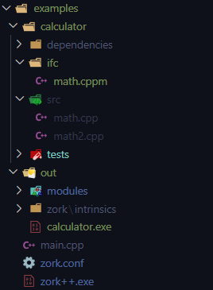

<p align="center">
  <a href="" rel="noopener">
 </a>
</p>

<h1 align="center">The Zork++ project</h1>

<h3 align="center"> A modern C++ project manager and build system for modern C++
</h3>
</br>

<div align="center">

[](https://github.com/zerodaycode/Zork/actions/workflows/code-quality.yml)
[](https://github.com/zerodaycode/Zork/issues) </br>
[](https://github.com/zerodaycode/Zork/pulls)
[](/LICENSE)
[](https://github.com/zerodaycode/Zork/actions/workflows/release.yml)

</div>

---
</br>

# 📝 Table of Contents

- [About](#about)
- [Getting Started](#getting_started)
- [The `zork.toml` quick start](#usage)
- [The `zork.toml` reference guide](#zork_toml_reference)
- [The `Zork++` command_line](#zork_command_line)
- [C++23 `import std;`](#import_std)
- [The developers and contributors guide](#devs_guide)
- [TODO ZONE](#todo_zone)
- [Built Using](#built_using)
- [Contributing](../CONTRIBUTING.md)
- [License](./LICENSE)
- [Authors](#authors)
- [Acknowledgments](#acknowledgement)

# 🧐 About <a name = "about"></a>

`Zork++` was born out of the need to build `C++` projects with the *modules* feature, introduced in the `C++20` standard.

The existing build systems have limitations and difficulties using the `C++20` modules in a consistent manner.
So we started designing a tool that takes some `C++` files, generates the necessary compiler commands and invokes the compiler to produce the desired executable/library!

# 🏁 Getting Started <a name = "getting_started"></a>

## Installation

The asiest way to start with `Zork++` is to download the [latest release
available](https://github.com/zerodaycode/Zork/releases) for your current operating system.
The packages are built for the `x86_64` architecture.

### Windows

We provide an automated installer that installs the `Zork++` binary on your system and automatically adds the installation directory to the `PATH` environment variable.

Simply download the `windows-installer.zip` artifact from the release page, extract it and run the contained `zork-installer.exe`.

### Debian based Distributions

We provide a `.deb` package for Debian based distributions.
After downloading it from the release page, install it by running the command

~~~bash
$ sudo apt install ./zork++.deb
~~~

### Arch Linux

The following packages are available in the AUR.

- `zork++`: Built from the sources of the latest release
- `zork++-git`: Built from the sources of the latest commit on the `main` branch
- `zork++-bin`: Installs a precompiled binary (fastest)

Using a AUR-helper such as `yay`:

~~~bash
$ yay -S zork++-bin
~~~

Or manually:

~~~bash
$ git clone https://aur.archlinux.org/zork++-bin.git && cd zork++-bin
$ makepkg -si
~~~

### Generic Linux package

We provide a generic `tar.gz` archive containing the executable and a `LICENSE`.
You can generally put the executable anywhere you like.
Be sure that the installation directory is found in the `PATH` environment variable, else it cannot be directly called from the command line without its installation path.
We recommend installing it in `/usr/bin`.

### MacOS and another platforms:

We currently don't provide installers or precompiled binaries for other operating systems. 

You can build `Zork++` manually if your platform is a supported `Rust` target.
You can checkout [the list of available targets here](https://doc.rust-lang.org/nightly/rustc/platform-support.html).

To build `Zork++` from scratch, download one of the `Source code` artifacts from the release page and extract it.
Then change into the `zork++` directory inside the extracted source code and run

~~~bash
$ cargo build --frozen --release
~~~

You can find the compiled binary inside the `target/release` directory.

## Prerequisites

In order to work with `Zork++`, you will need a `C++` a compiler on your system.
Currently, we are supporting the major three compilers in the ecosystem:

- LLVM's Clang
- GNU's GCC
- Microsoft's MSVC (only supported on Windows)

## Generating a new C++ project <a name = "getting_started_example"></a>

You can use `Zork++` with an already existing project, or create a new project from the command line.

- Choose an empty folder to kick off with a fresh start.
- Assuming that you have `zork++` in `PATH`, type:

`$ zork++ new github_example --compiler clang`

After a moment, a new project should be created in your desired directory.
And after that, move inside the folder, and type:

`$ zork++ run`

An output similar to the one below should appear in your terminal

```stdout
[2023-02-08T20:03:25Z INFO Zork++] Launching a new Zork++ program
[2023-02-08T20:03:25Z INFO Zork++] [SUCCESS] - The process ended succesfully, taking a total time in complete of: 349 ms

Hello from an autogenerated Zork project!
The program is running with: Clang

RESULT '+': 10
RESULT '-': 6
RESULT '*': 16
RESULT '/': 1
```

What happened here?

- We are calling the `zork++` executable previously installed on the system
- The subcommand `new` instructs `zork++` to autogenerate a new `C++` *modules* project with the name `github_example` .The project contains a predeterminated structure as shown below
- The parameter `--compiler clang` configures the project to use the `Clang` compiler
- With the `run` command, we are building the project based on the configuration that is written in the `zork_clang.toml` configuration file. After building the project, `Zork++` will automatically run the generated binary

<p align="center">
  <a href="" rel="noopener">
 </a>

*An autogenerated project using the `Zork++` command line*
</p>

### An overview of the autogenerated project structure

- `dependencies` => An empty folder. We recommend you to put your third-party or external libraries, headers, etc. in this folder.
- `ifc` => stands for *interfaces*. Here we put the *module interface units* of the project.
- `src` => where the *module implementation files* live.
- `tests` => where the *unit tests* and the *integration tests* of your new project are.
- `main.cpp` => The entry point for your `C++` program.
- `zork_clang.toml` => Finally! We arrived at the most important part that you will need to understand when working with `Zork++`.
See the [The zork.toml config file](#zork_conf) section to have a better understanding on how to write the configuration file and your project.

> Note that this structure is just a guideline. You may prefer to organize your files in a completely different way. We are just providing a predefined layout so you can quickly start working on your project.

## Let's explore the `out` directory a little bit

Here is where your compiler will place all the artifacts from the compilation and linkage process, including:

* The built executable / library
* Intermediate artifacts, such as object files and precompiled modules
* Some special folders, which are used internally by `Zork++`, such as the cache and some intrinsics.
Don't worry aboout them, they aren't relevant for the moment.

`Zork++` can build your project with different compilers at the same time.
To avoid collisions between the different build processes there is a separate directory for every compiler.

Let's go through the folders:

- `modules` => where the compiler places all the precompiled module interfaces, the object files for the `cpp` source files and so on.
- `zork/cache` => here we dump the cache files that store useful data to speed up the build process, to track some internally relevant data, or for storing the generated commands for the user to inspect (if you want to).
- `zork/intrinsics` => this is a special one. Sometimes `Zork++` needs additional things to work properly. This is the place where those things live. See [Windows special requeriments](#windows_special_requeriments) for more info.
- `github_example.exe` => this is the binary, that is generated by the build process.

# 🔧 The Zork's `zork.toml` config file <a name="usage"></a>

The `zork.toml` configuration file is the core of the project.
It is the most important part for woring with `Zork++`.
This is where you define the setup of your project, instructing `Zork++` to behave as you expect.
We are going to take the `zork.toml` from the [Getting started](#getting_started_example) example.

Here is the configuration file, that was generated above:

```toml
#This file it's autogenerated as an example of a Zork config file
[project]
name = "github-example"
authors = [ "Zero Day Code" ]  # Replace this for the real authors

[compiler]
cpp_compiler = "clang"
cpp_standard = "20"
std_lib = "libc++"  # This concrete property will only be applied to Clang

[build]
output_dir = "./out"

[executable]
executable_name = "github-example"
sources = [
    "./github-example/*.cpp"
]

[tests]
tests_executable_name = "zork_proj_tests"
sources = [
    "./github-example/*.cpp"
]

[modules]
base_ifcs_dir = "./github-example/ifc"
interfaces = [ 
    { file = 'math.cppm' }    
]
base_impls_dir = "./github-example/src"
implementations = [
    { file = 'math.cpp' },
    { file = 'math2.cpp', dependencies = ['math'] }
]
sys_modules = ['iostream']
```

This is `toml` table syntax. You may choose whatever `toml` available syntax you prefer though.

For a full reference of every property available under a specific section, please see the [zork.toml](#zork_toml_reference) reference guide.

## Let's briefly discuss every section, to get a general perspective of what we are building

- `[project]` => Here you specify the metadata for the project. This could be potentially more relevant in the future, to allow users to autopublish projects on some web sites.

- `[compiler]` => The configuration for the `C++` compiler. From the desired compiler that you want to use, the desired language level of the C++ ISO standard, to the `std` library vendor that you want to link against.
For now, the `std_lib` is only considered when using Clang on a Unix system.
It is used to specify whether to use the `libc++` or `libstdc++` Standard library implementation.

- `[build]` => Specifics about how and where the generated files are dumped or treated. Here you specify where you want to create that directory.

- `[executable]` => Whenever `Zork++` sees this attribute, it knows that he must produce an executable. You must specify the name of the generated binary and the sources that will be taken into consideration to produce that executable.

- `[modules]` => The core section to instruct the compiler to work with `C++20 modules`. The most important attributes are the base path to the *interfaces* and *implementation* files (usually you don't want to spread your files elsewhere).
`Zork++` only looks for your `interfaces` and `implementation` files in the respective directories.

- `[tests]` => The `tests` section allows you to run the tests written for your application in a convenient way.
You only have to provide the sources and you are ready to go!
`Zork++` will take care of the rest.

For now, tests run independent from the executables or library generations.
So if you want to check the health of your applications and run your tests, just invoke the `test` subcommand.

`$ zork++ -v test`

You must manually provide a test framework for now.
There are plans to include support for one or more of the major ones with `Zork++` directly, like `boost::ut` or `Catch2`.
But for now, you must manually download the source files and pass them (if applies) to `Zork++`.

The optional `base_path` property allows you to specify a path where `Zork++` looks for your source files, so you don't have to specify the full path for every source.

## Additional notes on the `[modules]` attribute

> Whenever you declare a module interface or a module implementation in the configuration file, you must take in consideration that sometimes modules (both interfaces or implementations) depend on other modules. Dependencies of one or more modules are declared as shown below:

```toml
interfaces = [ 
    { file = 'math.cppm' }    
]
implementations = [
    { file = 'math.cpp' }, # Direct mapping with the interface `math`
    { file = 'math2.cpp', dependencies = ['math'] } 
    # math2 isn't the same as math, so we need to specify the `math` dependency.
]
```

> The *module interface units*  can take any number of module dependencies as they wish, but there's no direct mapping on the no dependency declaration, because it's an interface unit.

> On the implementations, if the relation has no declared dependencies,
(meaning that only the file name of the *module implementation*
is declared here), `Zork++` will assume that the unique module interface that the module implementation depends on has the same name of the *file* property declared for the module implementation.

> A *module implementation unit* always depend on at least one interface unit: the *module interface* that public declared the module.
That's why `Zork++` assumes that if the implementation unit does not explicitly declare an interface unit, an interface unit exists with the same name in the interfaces directory (without file extension).

> If the user does not use the same file name for both
the interface and the declaration and no direct dependency is declared, a compiler error will be thrown because `Zork++` does not care about wrongly specified dependencies.

## Module partitions

One thing that we haven't discussed are `module partitions`. Described by the standard, the are two kinds of partitions, known as `module interface partitions` and `module implementation partitions` (or `internal partitions`). Both of them serve the same purpose: Allowing for better organization and modularization of the source code when projects start to grow larger or when you simply need a particular source code layout.

`Zork++` supports `module partitions` for every supported compiler, but they still have some peculiarities. Let's review them with an example:

```toml
[modules]
interfaces = [ 
    { file = 'interface_partition.cppm', partition = { module = 'partitions' } },
    { file = 'internal_partition.cpp', partition = { module = 'partitions', partition_name = 'internal_partition', is_internal_partition = true } },
    { file = 'partitions.cppm' }
]
``` 
*A closer look on how to work with module partitions within Zork++*

We included `partitions` inside the `interfaces` key because, most of the time, other module interfaces will require some partition, and having a separate key for them will break the way of letting you decide in which order the translation units must be processed.

So, whenever you see an *"interface"* that has a *partition* property, you must know that we are "downcasting" a module interface to some kind of partition.

Some pecularities by compiler at the time of writing:

- GCC => NONE! GCC comes with a powerful module cache, so no further threatment is required. You can write module partitions without any worry to declare them in `Zork++`.
- Clang => This requires you to fully specify partitions, indicating the module property, which is the property that tells `Zork++` which is its related primary module interface, and the partition name. If partition name isn't present, we will assume the name of the partition file.
- MSVC => Basically, we take advantage of the fantastic `MSVC` implicit module lookup.
This means that you aren't obligated to explicitly declare module names or module partition names... But, there's a specific case: `internal module partitions`. So, whenever you have an internal module partition, you must declare your translation unit as `partition`, and then provide at least `module` and `is_internal_partition` in order to make it work

> Note that in future releases, things about module partitions may change drastically (or not!). For example, we are expecting Clang to implement a good way of making implicit declarations but having the oportunity to specify a concrete output directory, among other things in other compilers too.

## The sys_modules property

`Clang` and `GCC` require precompiling the classical system headers, before they are importable as modules.
For example, whenever you use `import <iostream>` instead of using `#include` directives.
Every time you want to use `import<sys_module>` in your project, you can instruct `Zork` to precompile the corresponding system header in order to make it available as module.

# 📑 The `zork.toml` reference guide <a name="zork_toml_reference"></a>

Here is an overview of all the attributes available in the `zork.toml` configuration file.
The formt is described as `Rust` types (simplified).
Members marked as `Option<T>` are optional attributes, all other members are mandatory.

```Rust
/// The complete hierarchy of keys
ZorkConfigFile {
    project: ProjectAttribute,
    compiler: CompilerAttribute,
    build: Option<BuildAttribute>,
    executable: Option<ExecutableAttribute>,
    modules: Option<ModulesAttribute>,
    tests: Option<TestsAttribute>,
}

/// The [project] key 
ProjectAttribute {
    name: &'a str
    authors: Option<Vec<str>>,
}

/// The [compiler] key 
CompilerAttribute {
    cpp_compiler: CppCompiler, // clang, msvc or gcc
    cpp_standard: LanguageLevel, // but as a string, for ex: '20'
    std_lib: Option<str>, // libc++ or stdlibc++
    extra_args: Option<Vec<str>>
}

/// The [build] key 
BuildAttribute {
    output_dir: Option<str>,
}

/// The [executable] key
ExecutableAttribute {
    executable_name: Option<str>,
    sources_base_path: Option<str>,
    sources: Option<Vec<str>>,
    extra_args: Option<Vec<str>>,
}

/// [`ModulesAttribute`] -  The core section to instruct the compiler to work with C++20 modules. The most important are the base path to the interfaces and implementation files
/// * `base_ifcs_dir`- Base directory to shorcut the path of the implementation files
/// * `interfaces` - A list to define the module interface translation units for the project
/// * `base_impls_dir` - Base directory to shorcut the path of the implementation files
/// * `implementations` - A list to define the module interface translation units for the project
/// * `sys_modules` - An array field explicitly declare which system headers must be precompiled
ModulesAttribute {
    base_ifcs_dir: Option<str>,
    interfaces: Option<Vec<ModuleInterface>>,
    base_impls_dir: Option<str>,
    implementations: Option<Vec<ModuleImplementation>>,
    sys_modules: Option<Vec<str>>,
}

/// The [tests] key
TestsAttribute {
    test_executable_name: Option<str>,
    sources_base_path: Option<str>,
    sources: Option<Vec<str>>,
    extra_args: Option<Vec<str>>,
} 
```

## A closer look on the ModulesAttribute key

```Rust
/// [`ModuleInterface`] -  A module interface structure for dealing
/// with the parse work of prebuild module interface units
///
/// * `file`- The path of a primary module interface 
/// (relative to base_ifcs_path if applies)
///
/// * `module_name` - An optional field for make an explicit
/// declaration of the C++ module on this module interface 
/// with the `export module 'module_name' statement.
/// If this attribute isn't present, Zork++ will assume that the
/// C++ module declared within this file is equals 
/// to the filename
///
/// * `partition` - Whenever this attribute is present, 
/// we are telling Zork++ that the actual translation unit
/// is a partition, either an interface partition 
/// or an implementation partition unit
///
/// * `dependencies` - An optional array field for declare the module interfaces
/// in which this file is dependent on
ModuleInterface {
    file: str,
    module_name: Option<str>,
    partition: Option<ModulePartition>,
    dependencies: Option<Vec<str>>,
}

/// [`ModulePartition`] - Type for dealing with the parse work
/// of module partitions, either interfaces or implementations
///
/// * `module`- The interface module unit that this partitions belongs to
///
/// * `partition_name` - An optional field for explicitly declare the name of a module interface
/// partition, or a module implementation partition.
/// Currently this requirement is only needed if your partitions 
/// file names aren't declared as the modules convention,
/// that is `module_name-partition_name.extension`
///
/// * `is_internal_partition` - Optional field for declare that 
/// the module is actually a module for hold implementation
/// details, known as module implementation partitions.
/// This option only takes effect with MSVC
ModulePartition {
    module: str,
    partition_name: Option<&str>,
    is_internal_partition: Option<bool>,
}

/// [`ModuleImplementation`] -  Type for dealing with the parse work
/// of module implementation translation units
///
/// * `file`- The path of a primary module interface (relative to base_ifcs_path)
/// * `dependencies` - An optional array field for declare the module interfaces
/// in which this file is dependent on
ModuleImplementation<'a> {
    file: str,
    dependencies: Option<Vec<str>>,
}
```

## Some specific configuration values

Some attributes are categorical, meaning only some predefined values are valid.
For example:

- The supported CPP standards (`compiler.cpp_standard`) => '20', '23', '1a', '2a', '1x', '2x' or 'latest'
- The supported compilers (`compiler.cpp_compiler`):
  - clang => (alias = "CLANG", alias = "Clang", alias = "clang")
  - msvc  => (alias = "MSVC", alias = "Msvc", alias = "msvc")
  - gcc   => (alias = "MSVC", alias = "Msvc", alias = "msvc")
- The supported standard libraries to link against (`compiler.std_lib`, only applies to `Clang`) => 'stdlibc++' or 'libc++'

# 📑 The `Zork++` command line interface <a name="zork_command_line"></a>

`Zork++` comes with a minimalistic yet powerful command line interface.
Our direct intention was to mimic the standard way of working with `Rust`'s `Cargo` cli,
as it is a world class tool well known and valued.
To summarize, we are offering the following subcommands and arguments:

- `build` => just compiles the project
- `run` => compiles the project and then runs the generated binary
- `test` => compiles the project and then runs the test suite as described in the configuration file automatically
- *new* => generates a new `C++20` onwards template project with a minimal configuration and
a minimal setup. This command includes some arguments to make it more flexible, like:
  - `--name <NAME>` => the name of the autogenerated project
  - `--git` => initializes a new git empty repository
  - `--compiler <COMPILER>` => indicates which of the compilers available within `Zork++`
    should be used to set up the template

- `-v` => Outputs more information to stdout. The classical `verbose` command line flag

# 📑 C++23 `import std;` feature <a name="import_std"></a>

The `C++23` standard is supposed to come with a nice feature to finally support modules in a real way, that is through the `import std;` statement.
This means that the whole standard library will be available as a single nice and neat component.

But this is not available in every compiler using `C++20`, and at the time of writting, they have only
partial or no support at all for `C++23`, but some of them have their own kind of workarounds.

In `Zork++`, you have this feature enabled for any OS supported and even using `C++20` if:

- you're working with `Clang` because the `modulemap` feature of `Clang`. So, in your project, you're able to:
  - `import std;`  // preferred way, in line with the C++23 feature
  - `import <system_header_name>;` // individually import some specific system header as a module. Needs an explicit precompilation process.

- you're working with `MSVC`, you are able to use `import std.core`, as a compiler specific
feature. But this will allow you to use import statements instead of `#include` directives. 

# 🎈 Developers Guide <a name="devs_guide"></a>

Contributing to `Zork++` is, technically, an easy task. You just have to open an issue and document some bug that you discovered or some feature that you would like to have.

If you want to solve the bug or contribute with a new feature by yourself, after creating the issue, just fork the repository, link a new branch to your fork from the base branch, and when you're happy with the proposal, open a PR for us to review!

## ☑️ Running the tests

We distinguish two kind of tests in Zork:

### Unit tests

- These directly test different parts of the internal work of `Zork++`, trying to make a reliable system to work with.

### Integration tests

- Integration tests in Zork are focused on building different kind of `C++` projects under different operating systems.

All tests are running in different workflows that you can [check out here](
    <https://github.com/zerodaycode/Zork/actions>
).

Alternatively, you can always download the source code and run them in a local environment.
You will need to have `Rust` installed and change into the `zork++` directory.
Then you just need to run `$ cargo test --all`.

# 📑 TODO ZONE <a name = "todo_zone"></a>

## The things that we desire to implement or upgrade in Zork++

- Support the Intel's C++ compiler (not a priority, but it would be nice)
- Dump the commands generated in a text file different from the caché by a command line order
- Have full support for module (interface or implementation) partitions
- Take an eye on how the compilers are implementing the `C++23` `import std;` feature,
and then include it in `Zork++` by default
- Enable an option in the config file where the user can activate the parsing of the project
for every iteration by reading the data save in the cache and checking the last time that a
file included in the config file has been modified, so we will only be generating commands
for the modified files
- Include and offer test frameworks directly in the project. That means integrating
third party test frameworks directly in `Zork++`

# ⛏️ Built Using <a name = "built_using"></a>

- [Rust](https://www.rust-lang.org/) - The full code is written on Rust
- [Toml](https://www.python.org/) - We are using `toml` for the program configuration files

## TODO - Motivations for the style, etc

# ✍️ Authors <a name = "authors"></a>

- [@pyzyryab](https://github.com/pyzyryab) - Idea and core work
- [@gbm25](https://github.com/gbm25) - Parsers and testing attribute integration
- [@TheHiddenOnSystem](https://github.com/TheHiddenOnSystem) - Actions for autopublish the releases of the project
- [@foiP](https://github.com/foiP) - Nice code changes and upgrades, specially in the Rust rewrite

See also the list of [contributors](https://github.com/zerodaycode/Zork/contributors) who participated in this project.

# 🎉 Acknowledgements <a name = "acknowledgement"></a>

- This project is largely inspired by [CMake](https://cmake.org/) and [Rust's Cargo](https://www.rust-lang.org/)
